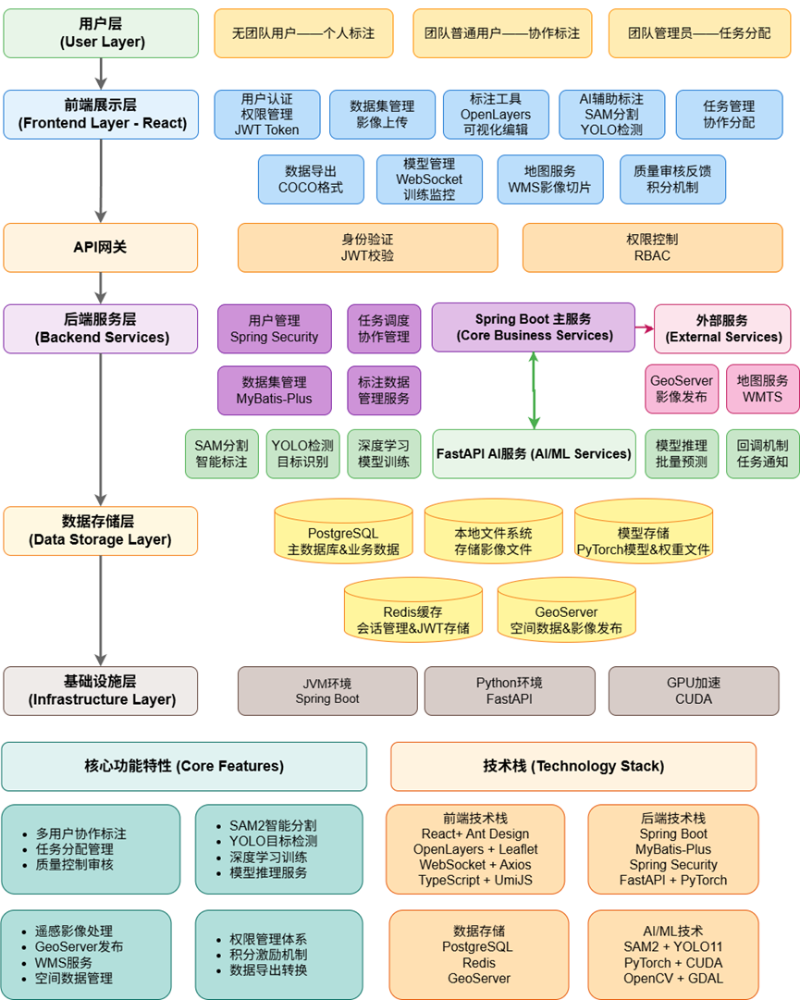
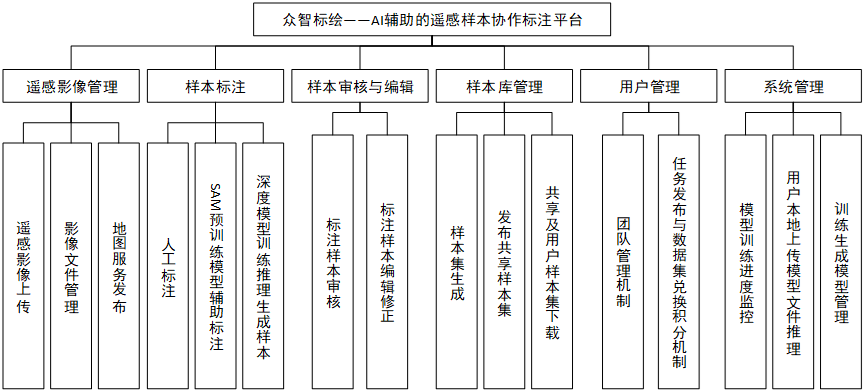
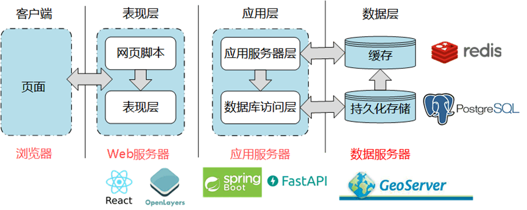
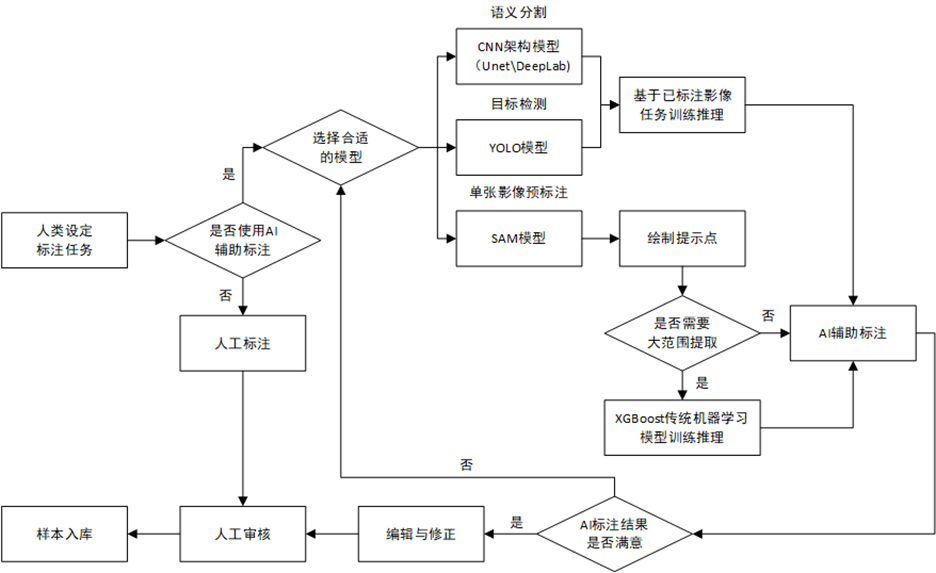
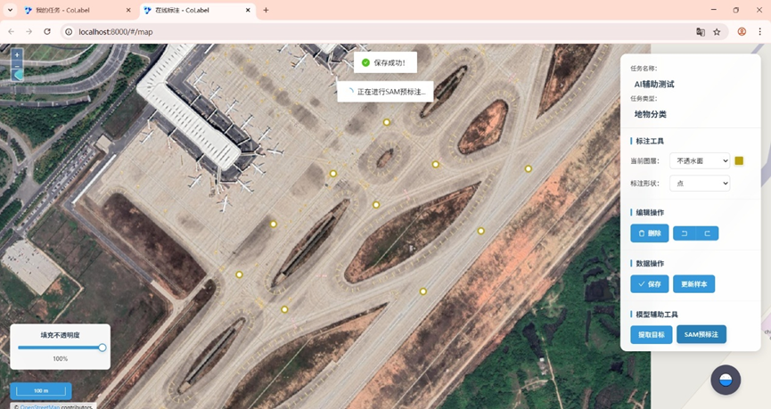
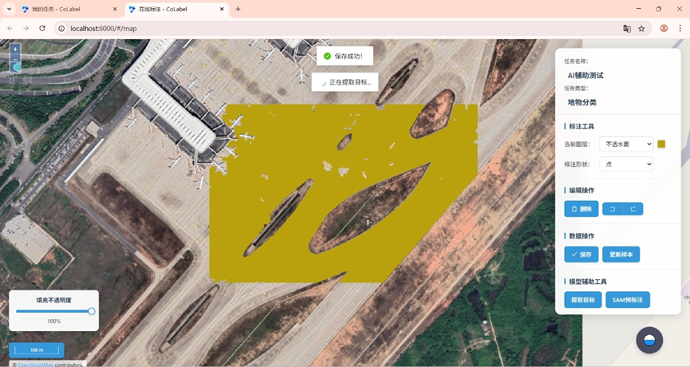
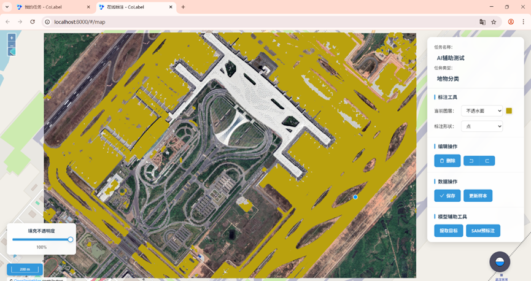
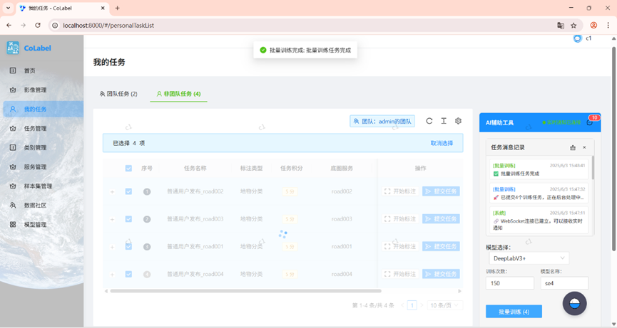
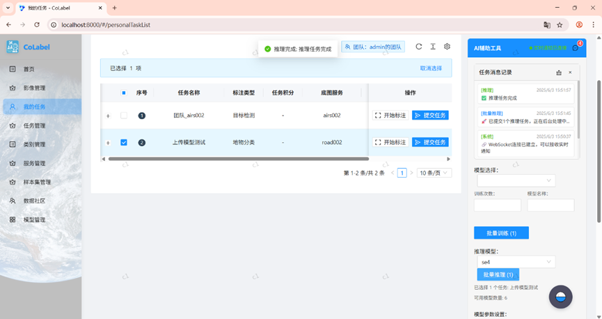
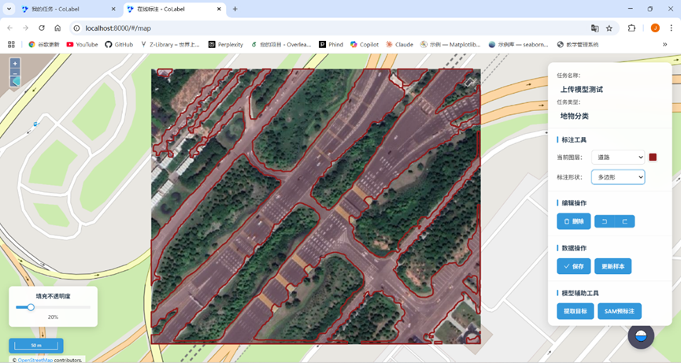

# AI辅助的遥感样本协作标注平台

## 项目简介

随着对地观测技术的飞速发展，海量遥感数据为各行业提供了关键信息源，但从中高效、准确地提取有价值信息仍面临巨大挑战。传统人工解译方式成本高昂且效率低下，难以满足大规模动态监测需求。以深度学习为代表的AI技术为此带来了新契机，但在高质量样本标注、高效协同作业、AI模型集成应用以及一体化流程构建等方面仍存在瓶颈。  

为应对上述挑战，本项目设计并开发实现了一个AI辅助的遥感样本协作标注平台。平台的核心目标是整合人机交互技术、人工智能算法以及在线协作方法，为用户提供一个从原始遥感影像接入到样本标注成果智能化生成、输出的一体化、高效能解决方案。  

本系统采用React、Spring Boot等技术进行开发，创新性地实现了异构技术栈的深度融合，集成了YOLO、SAM等AI辅助算法，建立团队管理与基于积分的数据社区共享激励机制。系统主要功能涵盖用户团队管理、遥感影像数据上传与服务发布、在线协同标注、AI辅助标注、在线模型训练与推理、标准化样本集生成与管理等。  

基于本系统实现的AI辅助标注模式、团队协作模式以及社区积分模式，将显著提升遥感影像标注和高质量数据集生产的效率，为促进深度学习模型在遥感领域的发展做出贡献。


---

## 系统架构



平台采用分层架构设计，主要包括：
- **SpringBoot后端**：负责主业务逻辑、用户管理、任务分配、数据接口等。
- **FastAPI后端**：负责深度学习相关的模型训练、推理与辅助标注。
- **React前端**：提供现代化的Web界面，支持标注、管理、协作等操作。
- **GeoServer**：用于遥感影像数据的存储与服务。

---

## 功能概览



平台提供从原始数据接入、高效协同标注、AI模型赋能，到成果管理与共享的完整功能链条.旨在构建一个全面覆盖遥感影像智能解译全流程的一体化解决方案。

---

## 技术栈



- **后端**：SpringBoot（Java）、FastAPI（Python）
- **前端**：React、Ant Design
- **数据库**：PostgreSQL
- **地理服务**：GeoServer
- **深度学习**：YOLO、SAM等

---

## 主要功能流程

### AI辅助标注流程

  

### 辅助标注示例





在“地物分类”任务中，绘制“点”样本作为提示点，再点击“SAM预标注”将根据提示点生产预标注样本，如果影像范围过大则可以选择点击“提取目标”使用XGBoost实现对整个影像的像素级分类。
### 模型训练及推理




平台提供用户友好的在线模型训练服务，支持用户基于平台内高质量标注数据，通过图形化界面选择模型架构、配置超参数并发起训练任务，后端应能自动化调度数据预处理和计算资源，并提供训练过程的可视化监控。  
训练完成的AI模型及其元数据纳入统一的模型库管理体系。最终，用户可从模型库选择模型对新影像执行推理，推理结果经智能化后处理后在前端可视化，并支持交互式编辑，形成模型应用与结果反馈的闭环。


---

## 目录结构

```
├── Backend(SpringBoot)   # Java后端主业务模块
├── Backend(FastAPI)      # Python FastAPI深度学习模块
├── Frontend(React)       # React前端主项目
├── images                # 项目相关图片
└── README.md             # 项目说明文档

```

---